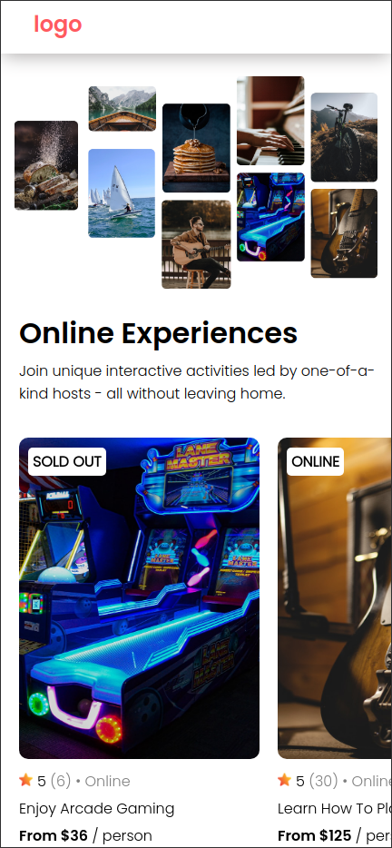

# Scrimba React Project #3: AirBnB Experiences clone

The goal of this project was to create an AirBnB Experiences website clone in React.

I started and finished this project in April 2023.

## Assignment

[Scrimba - Learn React - #3 AirBnB Experiences clone](https://scrimba.com/learn/learnreact)

## Technology

- React
- JavaScript
- Vite
- CSS

## Key Concepts

- JSX
- Custom components
- Custom attributes (props): making components reusable
- .map() function: converting data into an array of JSX components
- conditional rendering with &&: truthy & falsy

## Links

[Live Demo](https://bn7631-scrimba-clone.pages.dev)

## Screenshots

### Desktop


### Mobile



## Sources

- https://unsplash.com/photos/8lDkmXnKo7s by eberhard 🖐 grossgasteiger
- https://unsplash.com/photos/cTj8vbZeX44 by Giancarlo Duarte
- https://unsplash.com/photos/k6-usAW2aFw by Toby Otti
- https://unsplash.com/photos/QXSvbDkiJmY by Helena Yankovska
- https://unsplash.com/photos/TkzdkVn1AyA by Mae Mu
- https://unsplash.com/photos/eAYO8vKNeFQ by Jordan Whitfield
- https://unsplash.com/photos/ovJJZc0NUcE by CALEB SHAVER
- https://unsplash.com/photos/87mvOl39xmA by Lauren Forando
- https://unsplash.com/photos/O453M2Liufs by Luca Bravo
- <a href="https://www.freepik.com/icon/favourite_8906905">Icon by lalawidi</a>
- https://fonts.google.com/specimen/Poppins
 
## Deployment

```bash
# clone repo
git clone https://github.com/BrightNeon7631/scrimba-airbnb-clone.git

# install project dependencies
npm install

# run vite dev server
npm run dev

# create a production build
npm run build
```